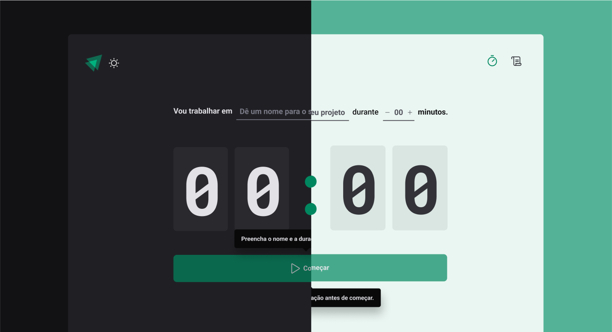

# Ignite Timer
> Trilha Ignite 

App Pomodoro que guarna as informações no localstorange
e quando iniciado o ciclo ele autera o titlulo da pagina
controtre de formulario para que quando estiver vazio desabilitar o botão de iniciar
e quando estiver iniciado desabilitar o campo de formulario
App completo utilizando os conceitos de uma SPA

[🔗 BY Rocketseat](https://github.com/rocketseat-education)

## 🛠 Tecnologias

- REACTJS
- VITEJS
- STYLED-COMPONENTS
- contextAPI
- REDUCER
- IMMER
- REACT-HOOK-FORM
- useEFECT
- REAC-ROUTER-DOM
- OUTLET
- TYPESCRIPT